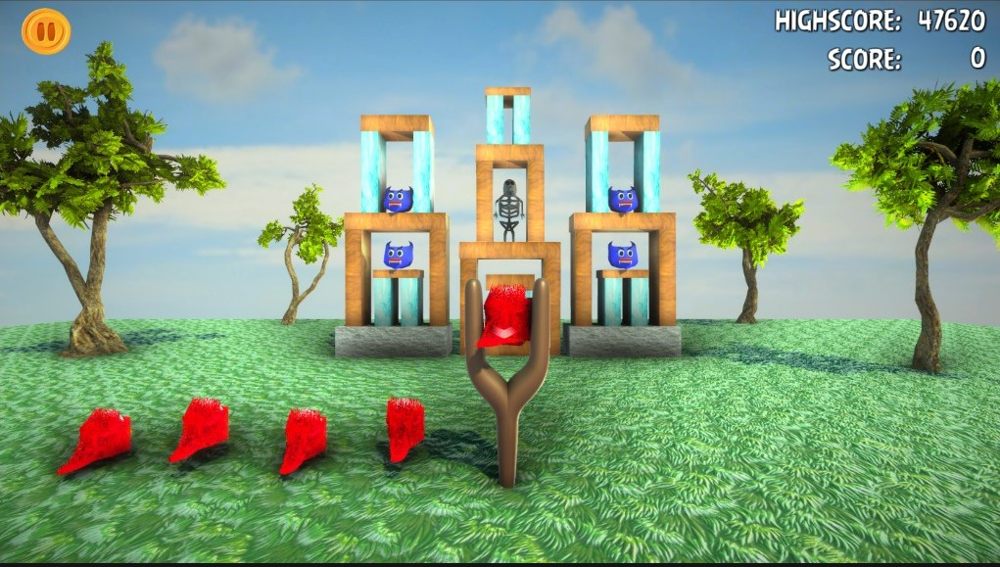

# 🎯 Slingshot Birds 3D

**A 3D game inspired by Angry Birds, developed as a Final Year Project using Unity and Blender.**

## 🕹️ Overview

Slingshot Birds 3D is a fun and engaging mobile game where players use a slingshot to fling birds into rickety buildings inhabited by green pigs. It includes various levels, birds, and environments—designed for both single-player and multiplayer (Facebook integration) modes.

## 🛠️ Built With

- **Unity 3D** – Game engine
- **C#** – Programming language
- **Blender** – 3D modeling
- **SQLite** – Lightweight backend database
- **Adobe Photoshop** – UI assets
- **Draw.io** – Diagrams

## 🧩 Game Features

- 🎮 Regular & Multiplayer Modes
- 🐦 Bird Unlock System with Unique Powers
- 🧱 Interactive Game Objects (Ice, Rock, Wood)
- 📊 Scoring System with XP and Gems
- 🎵 Music & Sound Toggle
- ☁️ Facebook Login & Leaderboards

## 📱 Platform

- Android (Unity Build)
- Windows (Development Platform)

<!-- Game poster - highlight it bigger -->

  

